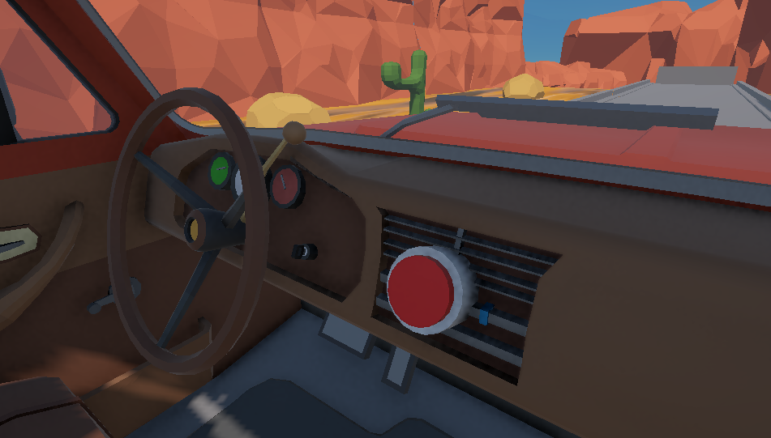
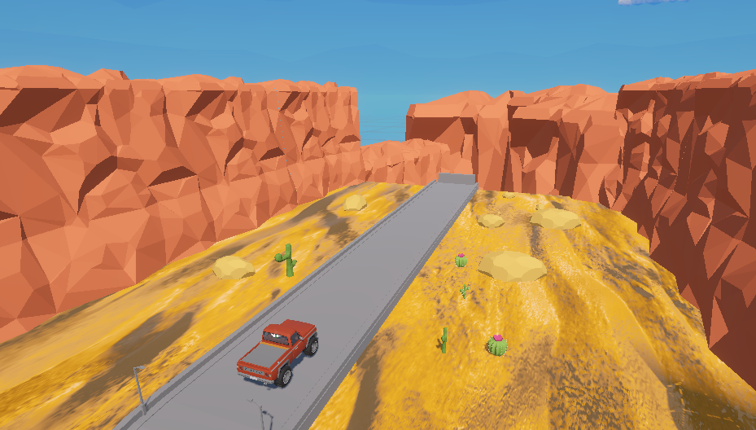
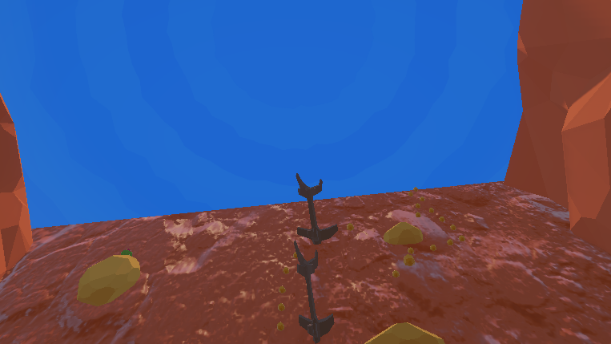

# LegIsBroken

## 개발 팀 (Development Team)
| 이름 (Name) | Github / Contact |
| :---  | :--- |
| **김규민** |  [@kkm0412]([Link](https://github.com/kkm0412)) |
| **김대원** |  [@GithubID](Link) |

## 게임 소개
*한밭대학교 인간과 컴퓨터 상호작용 25년/2학기 수업에서 제작한 텀프로젝트 결과물입니다.*

### 시놉시스
주인공은 교통사고로 절벽에서 추락했습니다
낙법 덕분에 살아남았지만 다리를 잃었습니다
구조연락을 할 방법은 없습니다, 직접 절벽 위로 다시 올라가는 방법 외에는요.

손으로 바위를 잡고 올라가 절벽을 등반하세요!
다리는 없지만 L.E.G.S.(Lifting Enhancement Grabbing System)은 있습니다!
LEGS로 잡을 수 없는 절벽을 고정시키세요!

과연 절벽 위까지 다시 올라가 구조를 받을수 있을까요?

▲유튜브 링크입니다▲
## 게임 플레이 방법
(메타퀘스트3 컨트롤러 기준입니다)

### 시작 방법:
시작화면에서 차량 중앙에 있는 빨간 버튼을 중지 트리거로 누르면 게임이 시작됩니다.

### 기본적인 이동방법
* 잡기: *중지 트리거*를 뉼러 바위를 잡거나 바닥을 잡을수 있습니다.
* 이동: 무언가를 잡은 상태에서 손을 당겨 몸을 이동시킵니다.
* 도약: 손을 빠르게 움직이며 *중지 트리거*를 놓으면 관성에 의해 몸이 튀어 나갑니다.
  * 이를 통해 팔이 닿지 않는 먼 거리를 도약 할 수 있습니다.

### LEGS 도구
* 장비 위치: LEGS는 몸의 중앙 제일 아래에 있습니다.
* 사용법:
  1. *중지 트리거*로 LEGS 장비를 잡습니다.
  2. 장비를 잡은 상태에서 벽에 가까이 다가가 *검지 트리거*를 눌러 작동시킵니다.
  3. 잡고 있는동안 장치는 벽에 고정 되며, 손에 닿지 않는 거리를 이동할수 있습니다.
  4. LEGS를 놓으면 LEGS가 원래 위치로 되돌아갑니다.

### 주의사항:
1. 고정된 위치에서 플레이 하는 것을 권장합니다.
2. 현재 캐릭터의 몸 위치를 강제로 초기화하는 로직은 구현되어있지 않습니다.
3. LEGS 부착 위치와 실제 몸 위치를 동기화하여 플레이 해주세요.
* 

## 사용한 리소스
Gemini가 생성한 코드, 노멀맵, 이미지

스카이박스: https://assetstore.unity.com/packages/vfx/shaders/free-skybox-extended-shader-107400

맵 소스: https://assetstore.unity.com/packages/3d/environments/landscapes/low-poly-desert-environment-pack-333554

도로: https://assetstore.unity.com/packages/3d/environments/roadways/low-poly-road-pack-67288

차량: https://assetstore.unity.com/packages/3d/vehicles/land/free-pickup-273052 
